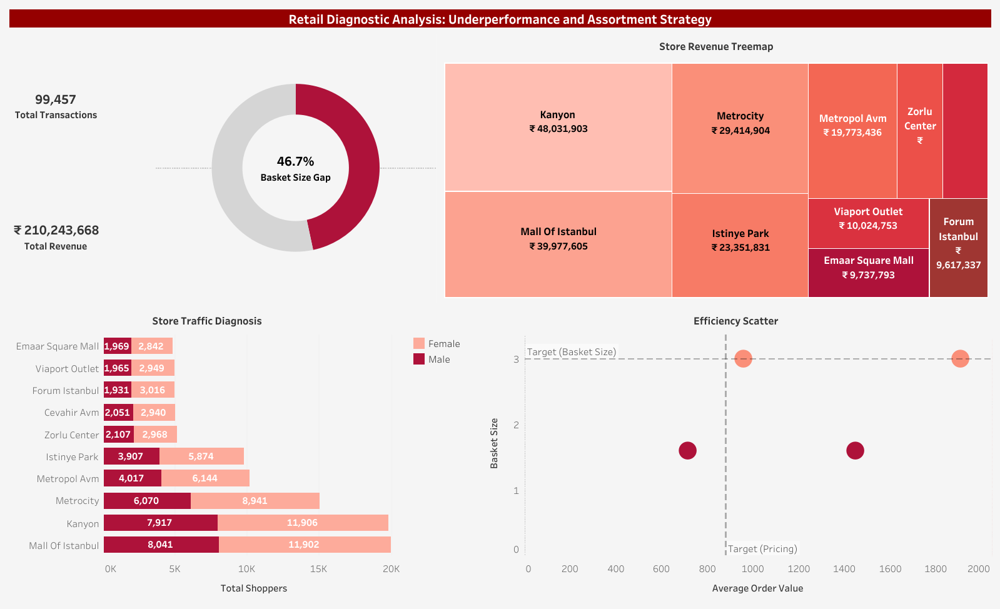

##  Retail Diagnostic Analysis: Underperformance and Assortment Strategy 

This project is a diagnostic analysis designed to identify and solve underperformance issues affecting the Commercial Performance of the Male Category across various store segments of a major retailer. The goal is to move beyond aggregated reporting to provide data-justified strategies for assortment correction and marketing spend reallocation.

***

###  Methodology & Execution

Data Modeling & Simulation (Power Query/M Language): Power Query is used to cleanse, model, and apply M language conditional logic to enforce business rules, accurately simulating the Male Category underperformance scenario.

Performance Diagnostics (SQL): Complex SQL queries (JOINs, GROUP BY) calculate key efficiency metrics like AOV and Basket Size, isolating specific low-performing store/category combinations.

Strategic Delivery (Tableau): SQL output is loaded into a Tableau dashboard to visualize findings and deliver data-backed strategies for assortment correction and marketing reallocation.
***

### Visual Analysis & Screenshots

#### 1. Tableau Dashboard Screenshot

***

###  Key Business Insights & Recommendations

The analysis identified key areas for immediate strategic action:

* **Efficiency Failure:** The analysis confirmed a twin efficiency failure where Male shoppers purchase fewer items (low Basket Size) at a lower average price (low AOV) compared to Female shoppers.

* **Efficiency Target:** The Male segment is performing 46.7% below the established Female Basket Size target.

* **Targeted Marketing:** The Bottom 3 revenue stores are also the stores with the lowest overall traffic and the lowest proportion of Male shoppers. **Recommendation:** Focus marketing spend exclusively on attracting Male traffic to these three specific store locations.
***

###  Tools & Techniques Used

**Power Query** data manipulation for cleaning and modeling raw retail sales data; 
**SQL** core performance analysis was executed in , where key efficiency metrics (Average Order Value, basket size) will be determined using complex JOINs and GROUP BY aggregations ;
**Visualization** in Tableau Desktop ;

***

### 📂 Repository Contents & Access

* **Tableau Dashboard:** `retail_diagnosis.twb` (Interactive workbook).
* **Live Dashboard Link:** [**View the Dashboard Live Here**](https://public.tableau.com/app/profile/meghna.sarkar5141/viz/retail_diagnosis/RetailDiagnosticAnalysis)
